# BookShelf 書籍レビューアプリ

## 概要

BookShelfは、書籍の登録・閲覧やレビュー投稿を通して、ユーザー同士で書籍の評価や感想を共有できる書籍レビューアプリケーションです。

書籍の登録・閲覧、レビュー投稿、お気に入り登録、ジャンル分類、レビューへのいいね、平均評価ランキングなどの基本機能に加え、キーワード・ジャンル・並び順を組み合わせた検索、Google Books APIを利用したISBN検索、マイ読書レポート、読書計画、リマインダー通知、Laravel SanctumによるAPI認証などを実装しています。

また、外部アプリケーションから書籍情報を利用できるJSON APIを提供しています。

## プロジェクトの目的

BookShelfは、ユーザーが書籍の情報やレビューを共有し、書籍選びや読書管理に活用できるWebアプリケーションを構築することを目的としています。

## 主な機能

### 認証機能

- ユーザー登録
- ログイン・ログアウト
- セッション認証によるアクセス制御

### 書籍機能

- 書籍一覧・詳細表示
- 書籍の登録・編集・削除
- 書籍一覧のページネーション
- キーワードによるタイトル・著者名検索
- ジャンルによる絞り込み
- 新着順・古い順・評価順・タイトル順による並び替え
- キーワード・ジャンル・並び順を組み合わせた検索
- ISBN-13によるGoogle Books API検索

### ジャンル機能

- ジャンル一覧・詳細表示
- ジャンルの登録・編集・削除
- 書籍へのジャンル設定
- ジャンルに紐づく書籍の表示

### レビュー機能

- 書籍へのレビュー投稿
- 自分が投稿したレビューの編集・削除
- 1〜5の5段階評価
- 同じユーザーによる同じ書籍への複数レビュー投稿
- レビューへのいいね・いいね解除
- レビューごとのいいね数表示

### お気に入り機能

- 書籍のお気に入り登録・解除
- ログインユーザーのお気に入り書籍一覧表示

### ランキング機能

- 書籍の平均評価が高い順にTOP10を表示
- レビューが投稿されていない書籍をランキング対象外として表示
- 平均評価が同じ場合は、レビュー件数が多い順、登録日の新しい順で表示

### マイ読書レポート

ログインユーザー自身が投稿したレビューをもとに、読書データを集計して表示します。

- 総レビュー数
- 読書した書籍数
- 平均評価
- 評価1〜5の分布
- 平均評価4.0以上の高評価書籍
- 高評価書籍の上位5件表示
- ジャンルごとの平均評価
- 評価の高いジャンルの上位5件表示

### 読書計画機能

- ログインユーザー自身の読書計画一覧表示
- 読書計画の登録・編集・削除
- 読書期限の設定
- `in_progress`（読書中）・`completed`（読了済み）・`expired`（期限切れ）の状態管理
- ステータスによる読書計画の絞り込み
- 読書期限の昇順で表示
- 読了処理
- 同一ユーザー・同一書籍について`in_progress`の読書計画を1件までに制限
- `completed`または`expired`の計画が存在する書籍への再計画
- 他ユーザーの読書計画に対する編集・削除・読了操作の制限
- 期限を過ぎた`in_progress`の読書計画を`expired`へ自動更新

### 通知・日次バッチ機能

- 読書期限3日前のリマインダー通知
- 読書期限当日のリマインダー通知
- 読書期限3日後のリマインダー通知
- Database Channelへの通知保存
- 通知一覧表示
- 通知の既読処理
- Laravel ScheduleとConsole Commandによる日次処理
- 毎日20:00（Asia/Tokyo）に読書計画の状態更新と通知処理を実行

### 公開API

- JSON形式による書籍情報の取得
- 書籍一覧取得
- 書籍詳細取得
- 書籍登録
- 書籍更新
- 書籍削除
- キーワード検索
- ジャンル絞り込み
- ページネーション
- Laravel SanctumによるAPIトークン認証
- GETは認証不要
- POST・PUT・DELETEはAPIトークン認証必須
- 書籍更新・削除は所有者のみ操作可能

## ER図

```mermaid
erDiagram
    USERS ||--o{ BOOKS : creates
    USERS ||--o{ REVIEWS : posts
    BOOKS ||--o{ REVIEWS : receives

    BOOKS ||--o{ BOOK_GENRE : has
    GENRES ||--o{ BOOK_GENRE : assigned

    USERS ||--o{ FAVORITES : favorites
    BOOKS ||--o{ FAVORITES : favorited

    USERS ||--o{ REVIEW_LIKES : likes
    REVIEWS ||--o{ REVIEW_LIKES : receives

    USERS ||--o{ READING_PLANS : plans
    BOOKS ||--o{ READING_PLANS : planned

    USERS ||--o{ NOTIFICATIONS : receives
    USERS ||--o{ PERSONAL_ACCESS_TOKENS : owns

    USERS {
        bigint id PK "unsigned・ユーザーID"
        varchar name "ユーザー名・最大255文字"
        varchar email UK "メールアドレス・最大255文字"
        timestamp email_verified_at "メール認証日時・NULL可"
        varchar password "ハッシュ化パスワード・最大255文字"
        varchar remember_token "ログイン保持トークン・最大100文字・NULL可"
        timestamp created_at "作成日時"
        timestamp updated_at "更新日時"
    }

    BOOKS {
        bigint id PK "unsigned・書籍ID"
        bigint user_id FK "unsigned・作成者ユーザーID・ON DELETE CASCADE"
        varchar title "タイトル・最大255文字"
        varchar author "著者名・最大255文字"
        char isbn UK "ISBN-13・13桁"
        date published_date "出版日・NULL可"
        text description "説明・NULL可"
        varchar image_url "画像URL・最大255文字・NULL可"
        timestamp created_at "作成日時"
        timestamp updated_at "更新日時"
    }

    GENRES {
        bigint id PK "unsigned・ジャンルID"
        varchar name UK "ジャンル名・最大255文字"
        timestamp created_at "作成日時"
        timestamp updated_at "更新日時"
    }

    BOOK_GENRE {
        bigint book_id PK, FK "unsigned・書籍ID・genre_idとの複合主キー・ON DELETE CASCADE"
        bigint genre_id PK, FK "unsigned・ジャンルID・book_idとの複合主キー・ON DELETE CASCADE"
    }

    REVIEWS {
        bigint id PK "unsigned・レビューID"
        bigint user_id FK "unsigned・投稿者ユーザーID・ON DELETE CASCADE"
        bigint book_id FK "unsigned・対象書籍ID・ON DELETE CASCADE"
        tinyint rating "unsigned・評価1〜5"
        text comment "レビューコメント・最大1000文字"
        timestamp created_at "作成日時"
        timestamp updated_at "更新日時"
    }

    FAVORITES {
        bigint id PK "unsigned・お気に入りID・自動連番"
        bigint user_id FK "unsigned・ユーザーID・book_idとの複合UNIQUE・ON DELETE CASCADE"
        bigint book_id FK "unsigned・書籍ID・user_idとの複合UNIQUE・ON DELETE CASCADE"
        timestamp created_at "作成日時"
        timestamp updated_at "更新日時"
    }

    REVIEW_LIKES {
        bigint id PK "unsigned・レビューいいねID・自動連番"
        bigint user_id FK "unsigned・ユーザーID・review_idとの複合UNIQUE・ON DELETE CASCADE"
        bigint review_id FK "unsigned・レビューID・user_idとの複合UNIQUE・ON DELETE CASCADE"
        timestamp created_at "作成日時"
        timestamp updated_at "更新日時"
    }

    READING_PLANS {
        bigint id PK "unsigned・読書計画ID"
        bigint user_id FK "unsigned・計画者ユーザーID・statusとの複合INDEX・ON DELETE CASCADE"
        bigint book_id FK "unsigned・対象書籍ID・ON DELETE CASCADE"
        date target_date "読書期限・INDEX"
        varchar status "in_progress・completed・expired・デフォルトin_progress"
        timestamp completed_at "読了日時・NULL可"
        timestamp created_at "作成日時"
        timestamp updated_at "更新日時"
    }

    NOTIFICATIONS {
        uuid id PK "通知ID"
        varchar type "通知クラス"
        varchar notifiable_type "通知対象モデル・ポリモーフィック"
        bigint notifiable_id "unsigned・通知対象ID・ポリモーフィック"
        text data "通知データ"
        timestamp read_at "既読日時・NULL可"
        timestamp created_at "作成日時"
        timestamp updated_at "更新日時"
    }

    PERSONAL_ACCESS_TOKENS {
        bigint id PK "unsigned・APIトークンID"
        varchar tokenable_type "トークン所有モデル・ポリモーフィック"
        bigint tokenable_id "unsigned・トークン所有者ID・ポリモーフィック"
        varchar name "トークン名・最大255文字"
        varchar token UK "トークン・64文字"
        text abilities "権限情報・NULL可"
        timestamp last_used_at "最終使用日時・NULL可"
        timestamp expires_at "有効期限・NULL可"
        timestamp created_at "作成日時"
        timestamp updated_at "更新日時"
    }
```



## 使用技術

| 分類               | 技術                                                      |
| ------------------ | --------------------------------------------------------- |
| バックエンド       | PHP 8.5                                                   |
| フレームワーク     | Laravel 10.x                                              |
| データベース       | MySQL 8.4                                                 |
| 開発環境           | Docker / Docker Compose / Laravel Sail                    |
| フロントエンド     | Blade / Tailwind CSS 3.4 / @tailwindcss/forms / Alpine.js |
| ビルドツール       | Vite 5                                                    |
| Web認証            | Laravel Fortify / セッション認証                          |
| API認証            | Laravel Sanctum                                           |
| 外部API            | Google Books API                                          |
| 通知               | Laravel Notification / Database Channel                   |
| 日次処理           | Laravel Schedule / Console Command                        |
| テスト             | PHPUnit 10                                                |
| コードフォーマット | Laravel Pint                                              |
| DB管理             | phpMyAdmin                                                |
| バージョン管理     | Git / GitHub                                              |

## 環境構築手順

### 1. 必要なソフトウェア

事前に以下をインストールしてください。

- Git
- Docker Desktop

### 2. リポジトリをクローン

```bash
git clone https://github.com/rn1052289-oss/bookshelf-app.git
cd bookshelf-app
```

### 3. Composerパッケージをインストール

Laravel Sailを起動するために必要なComposerパッケージをDocker経由でインストールします。

```bash
docker run --rm \
    -u "$(id -u):$(id -g)" \
    -v "$(pwd):/var/www/html" \
    -w /var/www/html \
    laravelsail/php85-composer:latest \
    composer install --ignore-platform-reqs
```

### 4. 環境変数ファイルを作成

`.env.example`をコピーして`.env`を作成します。

```bash
cp .env.example .env
```

データベース設定は以下を使用します。

```env
DB_CONNECTION=mysql
DB_HOST=mysql
DB_PORT=3306
DB_DATABASE=laravel
DB_USERNAME=sail
DB_PASSWORD=password
```

#### Google Books APIキーを取得

1. Google Cloud Consoleへログインします。
2. 使用するGoogle Cloudプロジェクトを作成または選択します。
3. Google Books APIを有効化します。
4. 「APIとサービス」→「認証情報」を開きます。
5. 「認証情報を作成」→「APIキー」を選択します。
6. 発行されたAPIキーをコピーします。

取得したAPIキーを`.env`へ設定します。

```env
GOOGLE_BOOKS_API_KEY=取得したAPIキー
GOOGLE_BOOKS_API_BASE_URL=https://www.googleapis.com/books/v1
```

APIキーなどの機密情報はGitへコミットしないでください。

### 5. Laravel Sailを起動

```bash
./vendor/bin/sail up -d
```

起動状態を確認する場合は、以下を実行します。

```bash
./vendor/bin/sail ps
```

### 6. アプリケーションキーを生成

```bash
./vendor/bin/sail artisan key:generate
```

### 7. フロントエンドのパッケージをインストール

```bash
./vendor/bin/sail npm install
```

### 8. MigrationとSeederを実行

```bash
./vendor/bin/sail artisan migrate:fresh --seed
```

このコマンドにより、テーブルを作成し、動作確認用の初期データを登録します。

### 動作確認用ユーザー

Seeder実行後は、以下のユーザーでログインできます。

| 名前     | メールアドレス        | パスワード |
| -------- | --------------------- | ---------- |
| 山田太郎 | yamada@example.com    | password   |
| 鈴木花子 | suzuki@example.com    | password   |
| 田中一郎 | tanaka@example.com    | password   |
| 佐藤美咲 | sato@example.com      | password   |
| 高橋健太 | takahashi@example.com | password   |

### 9. Viteを起動

別のターミナルで以下を実行します。

```bash
./vendor/bin/sail npm run dev
```

### 10. Laravel Schedulerを起動

読書計画のリマインダー通知・期限切れへの自動状態遷移を動作させる場合は、別のターミナルで以下を実行します。

```bash
./vendor/bin/sail artisan schedule:work
```

読書計画の日次処理は毎日20:00（Asia/Tokyo）に実行されます。

日次処理のみを手動で実行する場合は、以下を実行します。

```bash
./vendor/bin/sail artisan reading-plans:process
```

### 11. アプリケーションへアクセス

ブラウザで以下へアクセスします。

```text
http://localhost
```

phpMyAdminは以下からアクセスできます。

```text
http://localhost:8080
```

### 12. テストを実行

すべてのテストを実行します。

```bash
./vendor/bin/sail artisan test
```

テストカバレッジを確認する場合は、以下を実行します。

```bash
./vendor/bin/sail artisan test --coverage
```

応用機能を含むテストカバレッジ80%以上を目標とします。

### 13. コードフォーマットを確認

```bash
./vendor/bin/sail bin pint --test
```

### 14. Git差分の形式を確認

```bash
git diff --check
```

### 15. 開発環境を停止

```bash
./vendor/bin/sail down
```

## APIエンドポイント一覧

APIのベースURLは以下です。

```text
http://localhost/api/v1
```

| メソッド | パス                   | 認証            | 概要                                                  |
| -------- | ---------------------- | --------------- | ----------------------------------------------------- |
| POST     | `/api/v1/tokens`       | 不要            | メールアドレスとパスワードを使用してAPIトークンを発行 |
| GET      | `/api/v1/books`        | 不要            | 書籍一覧を取得                                        |
| GET      | `/api/v1/books/{book}` | 不要            | 指定した書籍の詳細を取得                              |
| POST     | `/api/v1/books`        | Sanctum認証必須 | 書籍を登録                                            |
| PUT      | `/api/v1/books/{book}` | Sanctum認証必須 | 所有する書籍を更新                                    |
| DELETE   | `/api/v1/books/{book}` | Sanctum認証必須 | 所有する書籍を削除                                    |

### 書籍一覧APIのクエリパラメータ

`GET /api/v1/books`では、以下の検索条件を使用できます。

| パラメータ | 必須 | 内容                                      |
| ---------- | ---- | ----------------------------------------- |
| `keyword`  | 任意 | 書籍タイトルまたは著者名の部分一致検索    |
| `genre`    | 任意 | ジャンルIDによる絞り込み                  |
| `page`     | 任意 | ページ番号。1以上の整数                   |
| `per_page` | 任意 | 1ページあたりの件数。1〜100。省略時は20件 |

公開APIでは`sort`パラメータによる並び替えは行いません。

存在しないジャンルIDを指定した場合はHTTP 404を返します。

### API認証

書籍の登録・更新・削除にはLaravel SanctumのAPIトークン認証を使用します。

`POST /api/v1/tokens`へ登録済みユーザーのメールアドレスとパスワードを送信するとAPIトークンが発行されます。

認証が必要なAPIでは、発行されたトークンをBearer Tokenとして指定します。

```text
Authorization: Bearer {token}
```

GETによる書籍一覧・書籍詳細取得には認証は必要ありません。

### 主なHTTPステータスコード

| ステータス | 内容                       |
| ---------- | -------------------------- |
| 200        | GET・PUT・トークン発行成功 |
| 201        | 書籍登録成功               |
| 204        | 書籍削除成功               |
| 401        | 認証エラー                 |
| 403        | 権限エラー                 |
| 404        | 対象データが存在しない     |
| 422        | バリデーションエラー       |

## 開発環境URL

| 項目             | URL                            |
| ---------------- | ------------------------------ |
| アプリケーション | http://localhost               |
| 書籍一覧         | http://localhost/books         |
| 会員登録         | http://localhost/register      |
| ログイン         | http://localhost/login         |
| ジャンル         | http://localhost/genres        |
| お気に入り       | http://localhost/favorites     |
| 読書計画         | http://localhost/reading-plans |
| マイ読書レポート | http://localhost/reports       |
| 通知             | http://localhost/notifications |
| ランキング       | http://localhost/ranking       |
| phpMyAdmin       | http://localhost:8080          |
| Book API         | http://localhost/api/v1/books  |

## リポジトリ

```text
https://github.com/rn1052289-oss/bookshelf-app
```

## 作成者

**中越 理来**

GitHub:

```text
https://github.com/rn1052289-oss
```
